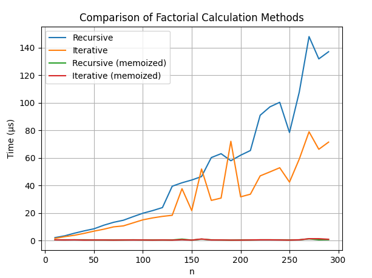

# Отчёт к лабораторной работе №5
## Тема: "Сравнение функций. Мемоизация"
---
Работу выполнил Елькин А.О.
---
## Постановка задачи:
Сравните время работы двух реализаций функции вычисления факториала:
- рекурсивной,
- нерекурсивной (через цикл).

Изучить материал про мемоизацию и реализовать сравнение мемоизованных и немемоизованных вариантов функций (рекурсивной и нерекурсивной). Проанализировать результаты и сделать выводы, описать выводы в отчете, построить графики.
Для сравнения используйте модуль `timeit`, а для наглядности постройте график с помощью `matplotlib`, показывающий зависимость времени выполнения от входных данных.
### Условия:
- Реализуйте две функции `fact_recursive(n)` и `fact_iterative(n)`.
- Для корректного сравнения используйте одинаковый набор чисел для тестирования.
- Визуализируйте результаты (ось X — размер входного числа n, ось Y — время вычислений).
- Сравните эффективность двух подходов.
### Требования: 
- Сгенерировать один фиксированный список чисел для всех прогонов и несколько раз запустить вычисления для усреднения.
- Необходимо провести "чистый бенчмарк" одного вызова (для одного числа) / показать replit. 

## Математическая модель
Факториал числа n определяется как:
$$n!=1\cdot2\cdot3\cdot...\cdot n$$

## Код программы
```python
import timeit
import matplotlib.pyplot as plt

# Memoization decorator
def memoize(func):
    cache = {}
    def wrapper(n):
        if n not in cache:
            cache[n] = func(n)
        return cache[n]   
    return wrapper

# Non-memoized factorial functions
def fact_recursive(n):
    if n == 0 or n == 1:
        return 1
    return n * fact_recursive(n - 1)

def fact_iterative(n):
    res = 1
    while n >= 1:
        res *= n
        n = n - 1
    return res

# Memoized factorial functions
@memoize
def fact_recursive_memo(n):
    if n == 0 or n == 1:
        return 1
    return n * fact_recursive_memo(n - 1)

@memoize
def fact_iterative_memo(n):
    res = 1
    while n >= 1:
        res *= n
        n = n - 1
    return res

# Benchmark function 
# Runs several repeats and takes the minimum time
def benchmark(func, data, number=1, repeat=5):
    total = 0
    for n in data:
        times = timeit.repeat(lambda: func(n), number=number, repeat=repeat)
        total += min(times)
    return total / len(data)

def main():
    test_data = list(range(10, 300, 10))

    # Clean one-run benchmark before any plotting or repeated benchmarking
    print("Clean benchmark of a single call:")

    n = 100

    # Clear memo caches explicitly
    fact_recursive_memo.__closure__[0].cell_contents.clear()
    fact_iterative_memo.__closure__[0].cell_contents.clear()

    t1 = timeit.timeit(lambda: fact_recursive(n), number=1)
    t2 = timeit.timeit(lambda: fact_iterative(n), number=1)
    t3 = timeit.timeit(lambda: fact_recursive_memo(n), number=1)
    t4 = timeit.timeit(lambda: fact_iterative_memo(n), number=1)

    print("Recursive:", t1)
    print("Iterative:", t2)
    print("Recursive (memoized):", t3)
    print("Iterative (memoized):", t4)

    # Benchmark for plotting
    res_recursive = []
    res_iterative = []
    res_recursive_memo = []
    res_iterative_memo = []

    # Clear caches again before the multi-run benchmark
    fact_recursive_memo.__closure__[0].cell_contents.clear()
    fact_iterative_memo.__closure__[0].cell_contents.clear()

    for n in test_data:
        res_recursive.append(benchmark(fact_recursive, [n]))
        res_iterative.append(benchmark(fact_iterative, [n]))
        res_recursive_memo.append(benchmark(fact_recursive_memo, [n]))
        res_iterative_memo.append(benchmark(fact_iterative_memo, [n]))

    # Plotting results
    plt.plot(test_data, res_recursive, label="Recursive")
    plt.plot(test_data, res_iterative, label="Iterative")
    plt.plot(test_data, res_recursive_memo, label="Recursive (memoized)")
    plt.plot(test_data, res_iterative_memo, label="Iterative (memoized)")

    plt.xlabel("n")
    plt.ylabel("Time (seconds)")
    plt.title("Comparison of Factorial Calculation Methods")
    plt.legend()
    plt.grid(True)
    plt.show()

if __name__ == "__main__":
    main()
```

## Результат работы программы
```
=== Clean benchmark: single call ===
Function                  | Time (µs)
---------------------------------------------
Recursive                 | 23.00
Iterative                 | 17.90
Recursive (memo)          | 93.20
Iterative (memo)          | 17.20
```



## Анализ результатов
### "Чистый бенчмарк" одного вызова
Однократный запуск для числа n = 100 показал:
- Рекурсивная функция стабильно медленнее итеративной
- Итеративная мемоизированная функция является самой быстрой среди остальных
- Рекурсивная мемоизированная медленнее из-за накладной рекурсивной структуры
### Многократный бенчмарк
Графики показывают:
- Итеративная версия стабильно быстрее рекурсивной, поскольку нет накладных расходов на вызовы функций.
- Рекурсивная мемоизация работает в разы быстрее обычной рекурсии, но немного медленнее итеративного подхода.
- Мемоизированная итеративная версия — самая производительная при повторных вызовах.

## Вывод
- Итеративная реализация вычисления факториала превосходит рекурсивную по скорости, благодаря отсутствию глубокой рекурсии и стековых вызовов.
- Мемоизация эффективна только при повторных вычислениях тех же значений.
- Мемоизированная итеративная функция оказывается наиболее производительной, особенно при многократных вызовах одних и тех же входных данных.
- "Чистый" однократный бенчмарк демонстрирует реальные затраты первого вызова.
### Итог:
- для единичных вычислений оптимальна обычная итерация,
- для повторяющихся — итерация с мемоизацией.
